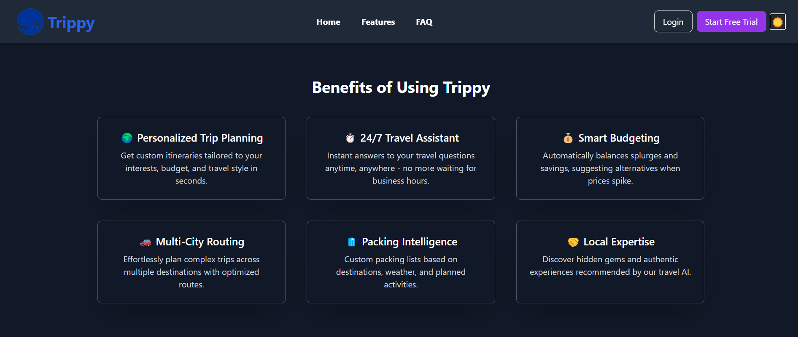
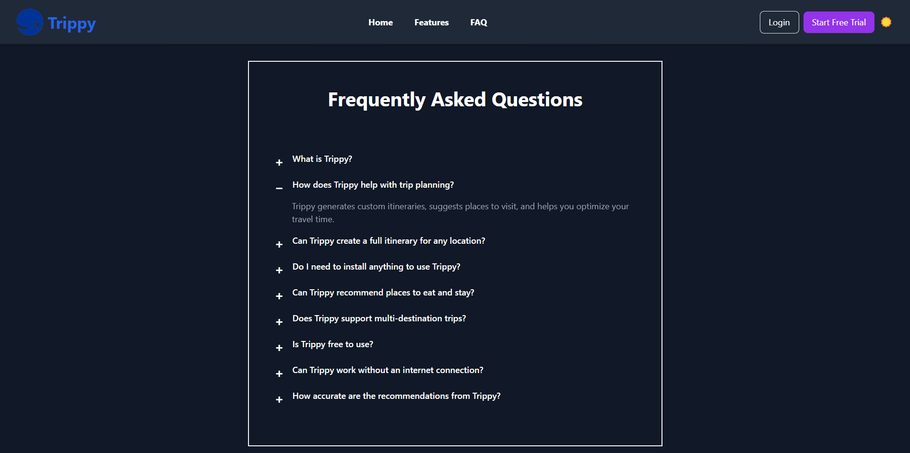
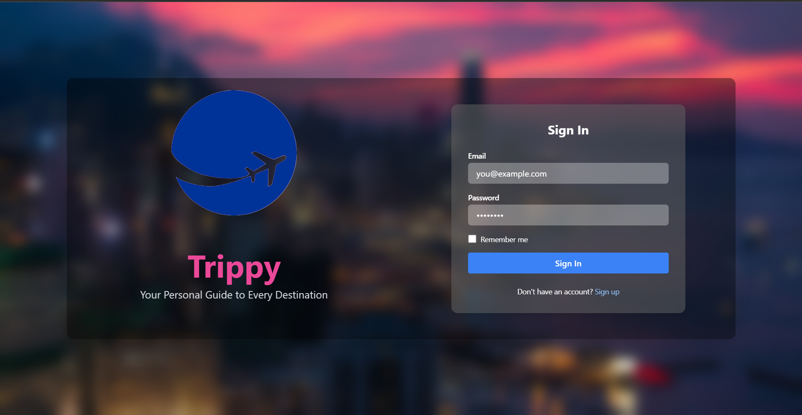
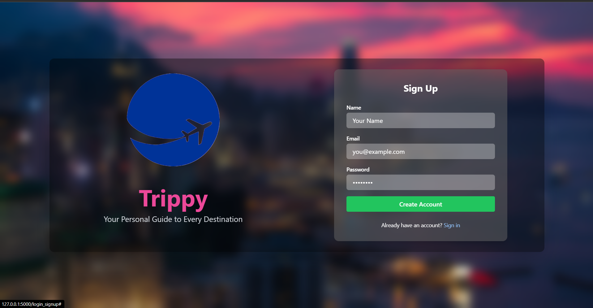
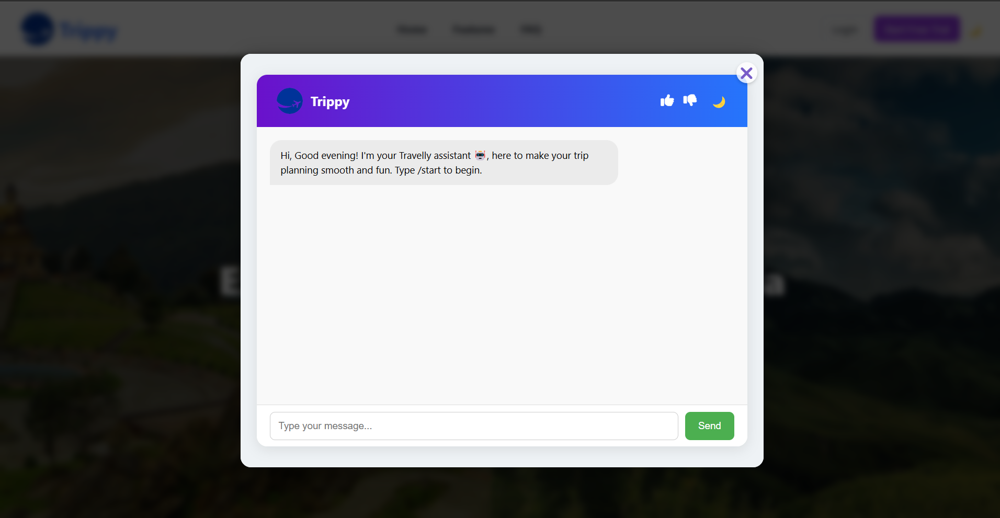
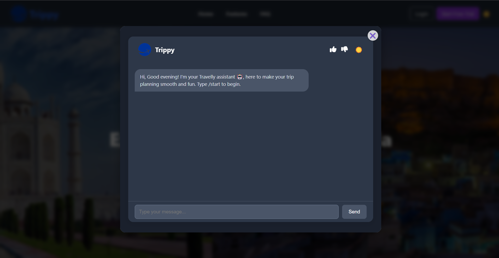

# 🧳 Trip Planner Bot

A smart and interactive travel assistant web app that helps users plan their trips based on input like source, destination, number of days, and budget. Built with vanilla **HTML, CSS, and JavaScript**.

## ✨ Features

- Conversational interface using a chatbot
- Collects:
  - Source city
  - Destination city
  - Travel duration
  - Approximate budget
- Smart response and trip suggestions (integrated with backend logic)
- Typing animation for realistic bot response
- Light/Dark mode toggle
- Feedback system (👍 / 👎)
- Ready for PDF export of the travel plan *(coming soon)*

## ⚙️ Tech Stack

- **Backend:** Python 3, Flask
- **Frontend:** HTML, CSS, JavaScript
- **API:** GeminiAPI

## 📦 Getting Started

1. **Clone the repository:**
```
git clone https://github.com/harsh-799/AI_TravelPlanner_Chatbot.git AI_TravelPlanner_Chatbot
cd AI_TravelPlanner_Chatbot
```
2. **Grab Your Own API**
- [Gemini API](https://aistudio.google.com/apikey)
- [Google Maps API](https://console.cloud.google.com/)

3. **Setup .env**
- Create one file named ```.env``` in root directory and paste your api keys there in below format.
```
GEMINI_API_KEY=Paste_your_API_Key
MAPS_API_KEY=Paste_your_API_Key
```

4. **Install dependencies:**
```
pip install -r requirements.txt
```

5. **Run the application:**
- Run the Flask application:
```
python app.py
```
- Open your web browser and navigate to:
```
http://localhost:5000
```

## 📸 Screenshots

### 🏠 Homepage




### 💬 Login/SignUp Pgae



### 💬 Chatbot Demo



## 🗂 Folder Structure
```
trip-planner/
├── static/
│   ├── screenshots/
│   ├── index.js
│   ├── indexstyle.css
│   ├── login_signup.css
│   ├── login_signup.js
│   ├── logo.png
│   ├── trippy.js
│   └── trippystyle.css
├── templates/
│   ├── index.html
│   ├── login_signup.html
│   └── trippy.html
├── .gitignore
├── app.py
├── requirements.txt
├── .env        
└── README.md
```

## 🤝 Contributing

Pull requests are welcome. Open an issue first to discuss major changes.


